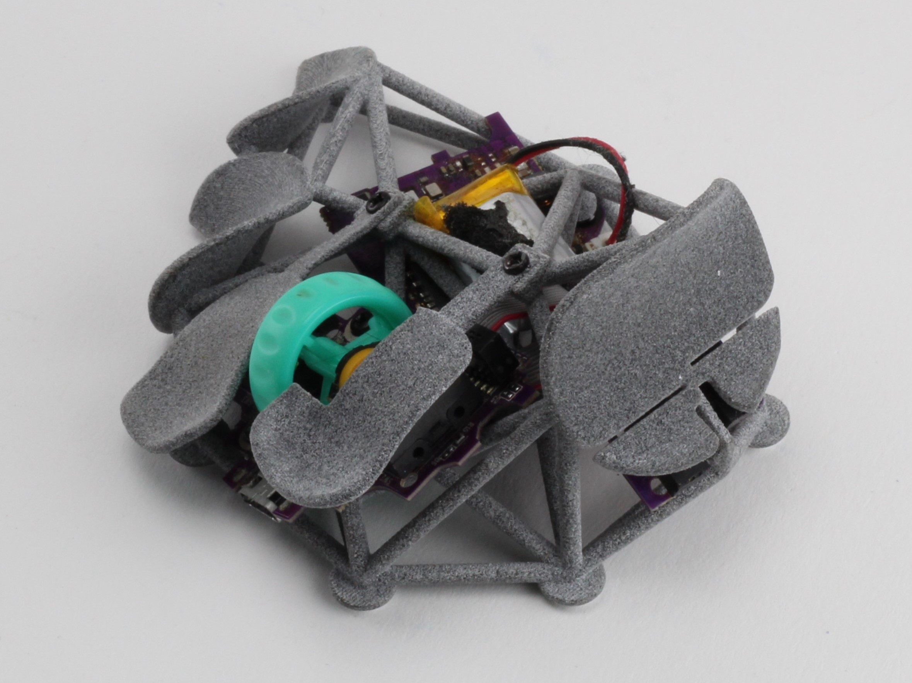
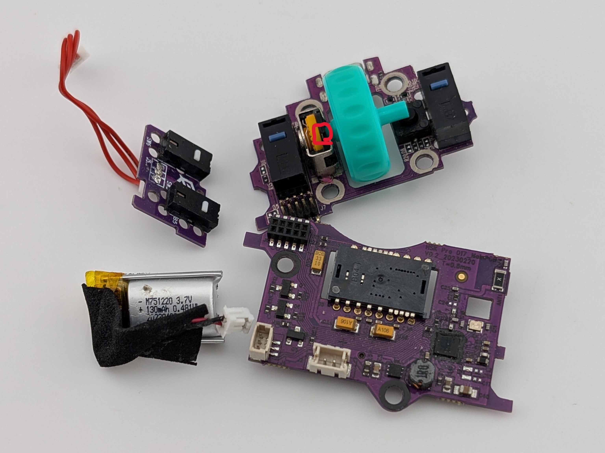
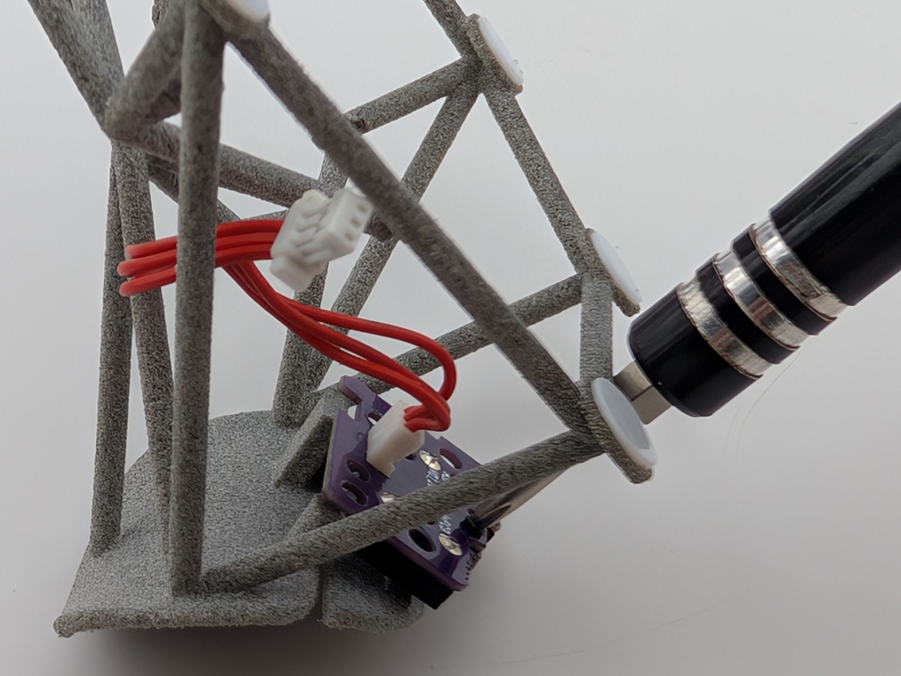
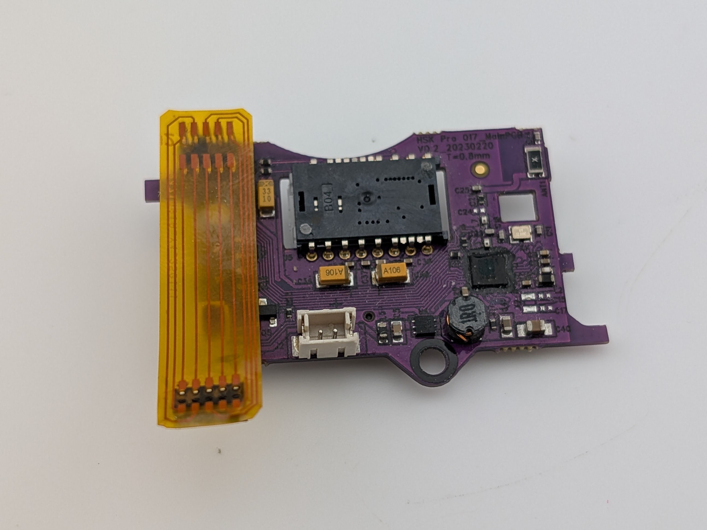
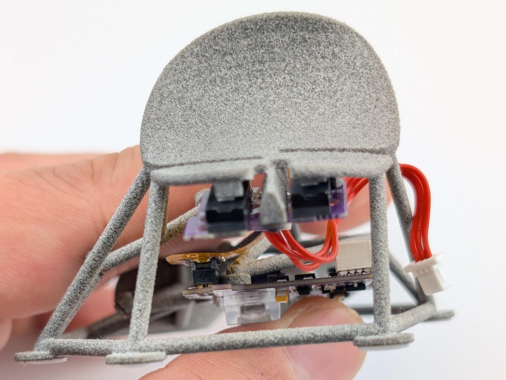
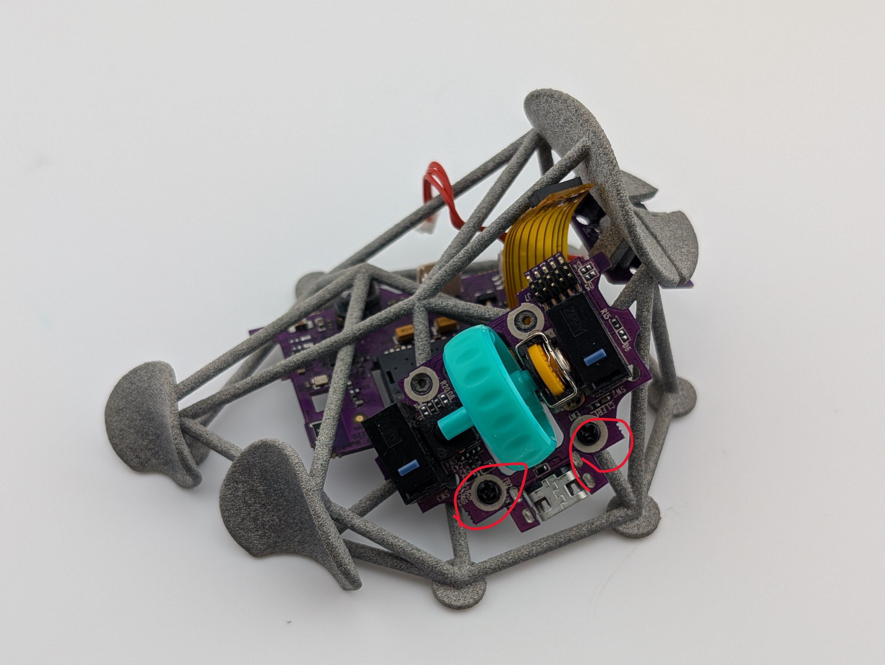
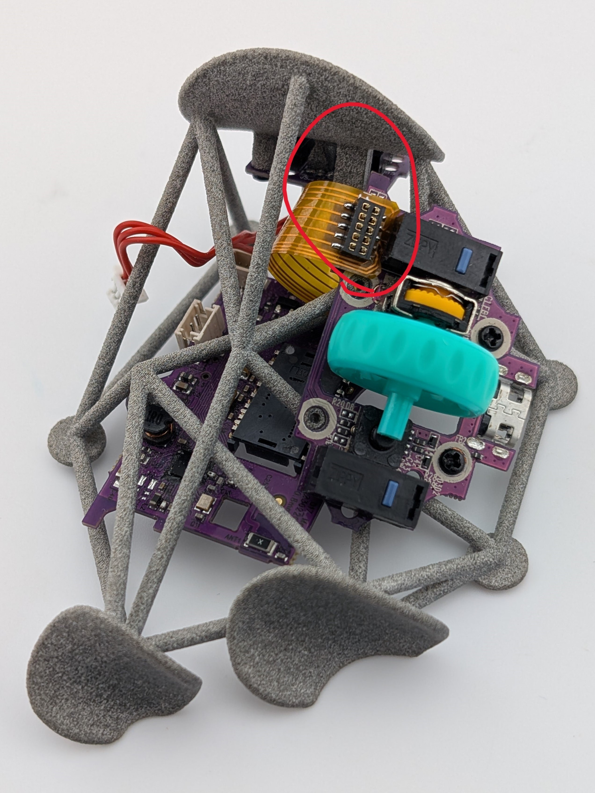
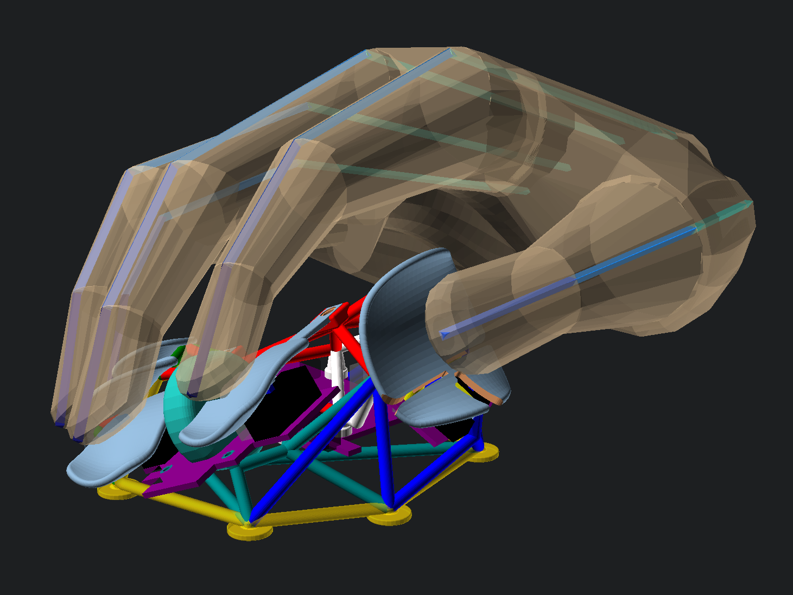

# Kotinos: Finger tip shell mod for HSK Pro

STLs are provided, but if you wish to modify them you can edit the SCAD files. Additional [BOSL2](https://github.com/BelfrySCAD/BOSL2) library is required.

This project is open sourced with the GPL-3.0 license. The license conditionally allows for commercial use, modification, distribution, patent, and private use. Please take note of the license conditions before utilizing this project.

## BOMs
|  | Part Name | Part Description | Quantity | Source |
| :---: | ----- | ----- | :-----: | ---- |
| 1 | Husk Pro | Mouse | 1 | [G-Wolves](https://shop.g-wolves.com/products/g-wolves-hsk-pro-4k) |  
| 2 | Kotinos | Main Shell | 1 | 3D Print Kotinos.stl |
| 3 |Index Paddle | Paddle for Right Mouse Button | 1 | 3D Print IndexPaddle.stl |
| 4 |Middle Paddle | Paddle for Left Mouse Button | 1 | 3D Print MiddlePaddle.stl |
| 5 | IDC Female Connector | 1.27mm pitch Mini dual rows IDC FC 10 pins Female | 1 | [amazon](https://www.amazon.com/Accessories-Connectors-Transition-Terminates-FC-10P-10PK/dp/B014BFVAUS?th=1)|    
| 6 | IDC Male Connector |1.27mm pitch Mini dual rows IDC FC 10 pins Male | 1 | [amazon](https://www.amazon.com/Accessories-Connectors-Transition-Terminates-FD-10P-20PK/dp/B07FD47BQD?th=1) |
| 7 | Ribbon Cable | 3cm length of 0.635mm pitch flat ribbon cable | 1 |  |
| 8 | M1.4 3mm | Thumb PCB Mount | 3 | |
| 9 | M1.4 3mm wide head |  Mounting Sensor PCB, Index PCB, and Paddles | 8 | HSK Pro |
| 10 | 6~7mm Skates | circular mouse skates | 7 | |

## Assembly Instruction

- Disassemble HSK Pro: Battery, side button PCB, encoder + buttons PCB, Sensor PCB and harvest ~8 screws
- Encoder wheel tends to slide off due to the tent angle; apply a dab of superglue on the wheel axis to fix it in place.
	
- Attach the side PCB to the shell first: use M1.4 3mm narrow head on the center post, M1.4 3mm narrow head near the notch and on the far corners
  
- Next is the sensor PCB: attach the jumper first, then slide it on to the shell and secure it with 2 M1.4 wide heads
  
  
- Attach the index PCB: first, secure the top 4 mount points with M1.4 wide heads. Attach the jumper then secure the paddles.
  
	
	
- Finally, plug in the side PCB jumper and the battery. You can slide in battery between the shell to secure it.
 

## Customization
Edit the following files to suit your need
- DataHand.scad stores the hand measurement that dictates the paddle placement
- Data*Finger*Paddle.scad for paddle surface modification
- MainBuild.scad to render modules and edit module placements

